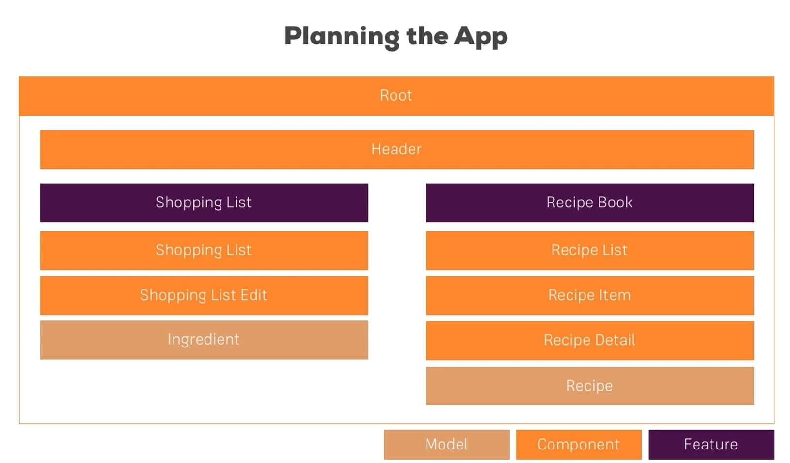

# Recipe App Angular

Cette application my-first-app a été développée dans le cadre de mon apprentissage du framework Angular, en suivant le cours Udemy dédié. Elle représente une étape importante dans mon parcours d'apprentissage, me permettant de mettre en pratique les concepts enseignés tout en explorant les fonctionnalités puissantes offertes par Angular.


## Version d'Angular CLI
Ce projet a été généré avec [Angular CLI](https://github.com/angular/angular-cli) version 17.1.1.


```js
ng new recipe-app-ng
```


## Librairie

[Bootstrap version 3](https://getbootstrap.com/docs/3.3/getting-started/)

```js
npm install --save bootstrap@3
```

Dans le fichier angular.json :

```js
"architect": {
    "build": {
        ...
        "options": {
        ...
        "styles": [
            "node_modules/bootstrap/dist/css/bootstrap.min.css",
            ...
        ],
        ...
        },
    }
}
```


## Structure de l'app




## Création des composants

